# homework2final
NinaE  
September 27, 2015  


Loading data:


```r
library(gapminder)
str(gapminder)
```

```
## 'data.frame':	1704 obs. of  6 variables:
##  $ country  : Factor w/ 142 levels "Afghanistan",..: 1 1 1 1 1 1 1 1 1 1 ...
##  $ continent: Factor w/ 5 levels "Africa","Americas",..: 3 3 3 3 3 3 3 3 3 3 ...
##  $ year     : num  1952 1957 1962 1967 1972 ...
##  $ lifeExp  : num  28.8 30.3 32 34 36.1 ...
##  $ pop      : num  8425333 9240934 10267083 11537966 13079460 ...
##  $ gdpPercap: num  779 821 853 836 740 ...
```

I am going to small test the data:


```r
mode(gapminder)
```

```
## [1] "list"
```

```r
class(gapminder)
```

```
## [1] "data.frame"
```

Gapfinder is a data.frame and it's in "list" mode


```r
head(gapminder)
```

```
##       country continent year lifeExp      pop gdpPercap
## 1 Afghanistan      Asia 1952  28.801  8425333  779.4453
## 2 Afghanistan      Asia 1957  30.332  9240934  820.8530
## 3 Afghanistan      Asia 1962  31.997 10267083  853.1007
## 4 Afghanistan      Asia 1967  34.020 11537966  836.1971
## 5 Afghanistan      Asia 1972  36.088 13079460  739.9811
## 6 Afghanistan      Asia 1977  38.438 14880372  786.1134
```

```r
tail(gapminder)
```

```
##       country continent year lifeExp      pop gdpPercap
## 1699 Zimbabwe    Africa 1982  60.363  7636524  788.8550
## 1700 Zimbabwe    Africa 1987  62.351  9216418  706.1573
## 1701 Zimbabwe    Africa 1992  60.377 10704340  693.4208
## 1702 Zimbabwe    Africa 1997  46.809 11404948  792.4500
## 1703 Zimbabwe    Africa 2002  39.989 11926563  672.0386
## 1704 Zimbabwe    Africa 2007  43.487 12311143  469.7093
```

```r
gapminder[sample(nrow(gapminder), 10), ]
```

```
##          country continent year lifeExp      pop gdpPercap
## 1232      Poland    Europe 1987  70.980 37740710  9082.351
## 449      Ecuador  Americas 1972  58.796  6298651  5280.995
## 573      Germany    Europe 1992  76.070 80597764 26505.303
## 39        Angola    Africa 1962  34.000  4826015  4269.277
## 1218 Philippines      Asia 1977  60.060 46850962  2373.204
## 1358   Singapore      Asia 1957  63.179  1445929  2843.104
## 1047     Myanmar      Asia 1962  45.108 23634436   388.000
## 750      Ireland    Europe 1977  72.030  3271900 11150.981
## 77       Austria    Europe 1972  70.630  7544201 16661.626
## 1446       Sudan    Africa 1977  47.800 17104986  2202.988
```

```r
View(gapminder)
names(gapminder)
```

```
## [1] "country"   "continent" "year"      "lifeExp"   "pop"       "gdpPercap"
```

```r
ncol(gapminder)
```

```
## [1] 6
```

```r
nrow(gapminder)
```

```
## [1] 1704
```

```r
dim(gapminder)
```

```
## [1] 1704    6
```

It has 6 variables, 6 columns and 1704 rows

Variable flavors:
county, continent: factor variables
Year, lifeExp, pop and gdpPercap: numerical variables

Exploring variables:


```r
class(gapminder$continent)
```

```
## [1] "factor"
```

```r
summary(gapminder$continent)
```

```
##   Africa Americas     Asia   Europe  Oceania 
##      624      300      396      360       24
```

```r
table(gapminder$contintent)
```

```
## < table of extent 0 >
```

```r
levels(gapminder$continent)
```

```
## [1] "Africa"   "Americas" "Asia"     "Europe"   "Oceania"
```

```r
nlevels(gapminder$continent)
```

```
## [1] 5
```

```r
unclass(gapminder$continent)
```

```
##    [1] 3 3 3 3 3 3 3 3 3 3 3 3 4 4 4 4 4 4 4 4 4 4 4 4 1 1 1 1 1 1 1 1 1 1
##   [35] 1 1 1 1 1 1 1 1 1 1 1 1 1 1 2 2 2 2 2 2 2 2 2 2 2 2 5 5 5 5 5 5 5 5
##   [69] 5 5 5 5 4 4 4 4 4 4 4 4 4 4 4 4 3 3 3 3 3 3 3 3 3 3 3 3 3 3 3 3 3 3
##  [103] 3 3 3 3 3 3 4 4 4 4 4 4 4 4 4 4 4 4 1 1 1 1 1 1 1 1 1 1 1 1 2 2 2 2
##  [137] 2 2 2 2 2 2 2 2 4 4 4 4 4 4 4 4 4 4 4 4 1 1 1 1 1 1 1 1 1 1 1 1 2 2
##  [171] 2 2 2 2 2 2 2 2 2 2 4 4 4 4 4 4 4 4 4 4 4 4 1 1 1 1 1 1 1 1 1 1 1 1
##  [205] 1 1 1 1 1 1 1 1 1 1 1 1 3 3 3 3 3 3 3 3 3 3 3 3 1 1 1 1 1 1 1 1 1 1
##  [239] 1 1 2 2 2 2 2 2 2 2 2 2 2 2 1 1 1 1 1 1 1 1 1 1 1 1 1 1 1 1 1 1 1 1
##  [273] 1 1 1 1 2 2 2 2 2 2 2 2 2 2 2 2 3 3 3 3 3 3 3 3 3 3 3 3 2 2 2 2 2 2
##  [307] 2 2 2 2 2 2 1 1 1 1 1 1 1 1 1 1 1 1 1 1 1 1 1 1 1 1 1 1 1 1 1 1 1 1
##  [341] 1 1 1 1 1 1 1 1 2 2 2 2 2 2 2 2 2 2 2 2 1 1 1 1 1 1 1 1 1 1 1 1 4 4
##  [375] 4 4 4 4 4 4 4 4 4 4 2 2 2 2 2 2 2 2 2 2 2 2 4 4 4 4 4 4 4 4 4 4 4 4
##  [409] 4 4 4 4 4 4 4 4 4 4 4 4 1 1 1 1 1 1 1 1 1 1 1 1 2 2 2 2 2 2 2 2 2 2
##  [443] 2 2 2 2 2 2 2 2 2 2 2 2 2 2 1 1 1 1 1 1 1 1 1 1 1 1 2 2 2 2 2 2 2 2
##  [477] 2 2 2 2 1 1 1 1 1 1 1 1 1 1 1 1 1 1 1 1 1 1 1 1 1 1 1 1 1 1 1 1 1 1
##  [511] 1 1 1 1 1 1 4 4 4 4 4 4 4 4 4 4 4 4 4 4 4 4 4 4 4 4 4 4 4 4 1 1 1 1
##  [545] 1 1 1 1 1 1 1 1 1 1 1 1 1 1 1 1 1 1 1 1 4 4 4 4 4 4 4 4 4 4 4 4 1 1
##  [579] 1 1 1 1 1 1 1 1 1 1 4 4 4 4 4 4 4 4 4 4 4 4 2 2 2 2 2 2 2 2 2 2 2 2
##  [613] 1 1 1 1 1 1 1 1 1 1 1 1 1 1 1 1 1 1 1 1 1 1 1 1 2 2 2 2 2 2 2 2 2 2
##  [647] 2 2 2 2 2 2 2 2 2 2 2 2 2 2 3 3 3 3 3 3 3 3 3 3 3 3 4 4 4 4 4 4 4 4
##  [681] 4 4 4 4 4 4 4 4 4 4 4 4 4 4 4 4 3 3 3 3 3 3 3 3 3 3 3 3 3 3 3 3 3 3
##  [715] 3 3 3 3 3 3 3 3 3 3 3 3 3 3 3 3 3 3 3 3 3 3 3 3 3 3 3 3 3 3 4 4 4 4
##  [749] 4 4 4 4 4 4 4 4 3 3 3 3 3 3 3 3 3 3 3 3 4 4 4 4 4 4 4 4 4 4 4 4 2 2
##  [783] 2 2 2 2 2 2 2 2 2 2 3 3 3 3 3 3 3 3 3 3 3 3 3 3 3 3 3 3 3 3 3 3 3 3
##  [817] 1 1 1 1 1 1 1 1 1 1 1 1 3 3 3 3 3 3 3 3 3 3 3 3 3 3 3 3 3 3 3 3 3 3
##  [851] 3 3 3 3 3 3 3 3 3 3 3 3 3 3 3 3 3 3 3 3 3 3 3 3 3 3 1 1 1 1 1 1 1 1
##  [885] 1 1 1 1 1 1 1 1 1 1 1 1 1 1 1 1 1 1 1 1 1 1 1 1 1 1 1 1 1 1 1 1 1 1
##  [919] 1 1 1 1 1 1 1 1 1 1 1 1 1 1 1 1 1 1 3 3 3 3 3 3 3 3 3 3 3 3 1 1 1 1
##  [953] 1 1 1 1 1 1 1 1 1 1 1 1 1 1 1 1 1 1 1 1 1 1 1 1 1 1 1 1 1 1 1 1 2 2
##  [987] 2 2 2 2 2 2 2 2 2 2 3 3 3 3 3 3 3 3 3 3 3 3 4 4 4 4 4 4 4 4 4 4 4 4
## [1021] 1 1 1 1 1 1 1 1 1 1 1 1 1 1 1 1 1 1 1 1 1 1 1 1 3 3 3 3 3 3 3 3 3 3
## [1055] 3 3 1 1 1 1 1 1 1 1 1 1 1 1 3 3 3 3 3 3 3 3 3 3 3 3 4 4 4 4 4 4 4 4
## [1089] 4 4 4 4 5 5 5 5 5 5 5 5 5 5 5 5 2 2 2 2 2 2 2 2 2 2 2 2 1 1 1 1 1 1
## [1123] 1 1 1 1 1 1 1 1 1 1 1 1 1 1 1 1 1 1 4 4 4 4 4 4 4 4 4 4 4 4 3 3 3 3
## [1157] 3 3 3 3 3 3 3 3 3 3 3 3 3 3 3 3 3 3 3 3 2 2 2 2 2 2 2 2 2 2 2 2 2 2
## [1191] 2 2 2 2 2 2 2 2 2 2 2 2 2 2 2 2 2 2 2 2 2 2 3 3 3 3 3 3 3 3 3 3 3 3
## [1225] 4 4 4 4 4 4 4 4 4 4 4 4 4 4 4 4 4 4 4 4 4 4 4 4 2 2 2 2 2 2 2 2 2 2
## [1259] 2 2 1 1 1 1 1 1 1 1 1 1 1 1 4 4 4 4 4 4 4 4 4 4 4 4 1 1 1 1 1 1 1 1
## [1293] 1 1 1 1 1 1 1 1 1 1 1 1 1 1 1 1 3 3 3 3 3 3 3 3 3 3 3 3 1 1 1 1 1 1
## [1327] 1 1 1 1 1 1 4 4 4 4 4 4 4 4 4 4 4 4 1 1 1 1 1 1 1 1 1 1 1 1 3 3 3 3
## [1361] 3 3 3 3 3 3 3 3 4 4 4 4 4 4 4 4 4 4 4 4 4 4 4 4 4 4 4 4 4 4 4 4 1 1
## [1395] 1 1 1 1 1 1 1 1 1 1 1 1 1 1 1 1 1 1 1 1 1 1 4 4 4 4 4 4 4 4 4 4 4 4
## [1429] 3 3 3 3 3 3 3 3 3 3 3 3 1 1 1 1 1 1 1 1 1 1 1 1 1 1 1 1 1 1 1 1 1 1
## [1463] 1 1 4 4 4 4 4 4 4 4 4 4 4 4 4 4 4 4 4 4 4 4 4 4 4 4 3 3 3 3 3 3 3 3
## [1497] 3 3 3 3 3 3 3 3 3 3 3 3 3 3 3 3 1 1 1 1 1 1 1 1 1 1 1 1 3 3 3 3 3 3
## [1531] 3 3 3 3 3 3 1 1 1 1 1 1 1 1 1 1 1 1 2 2 2 2 2 2 2 2 2 2 2 2 1 1 1 1
## [1565] 1 1 1 1 1 1 1 1 4 4 4 4 4 4 4 4 4 4 4 4 1 1 1 1 1 1 1 1 1 1 1 1 4 4
## [1599] 4 4 4 4 4 4 4 4 4 4 2 2 2 2 2 2 2 2 2 2 2 2 2 2 2 2 2 2 2 2 2 2 2 2
## [1633] 2 2 2 2 2 2 2 2 2 2 2 2 3 3 3 3 3 3 3 3 3 3 3 3 3 3 3 3 3 3 3 3 3 3
## [1667] 3 3 3 3 3 3 3 3 3 3 3 3 3 3 1 1 1 1 1 1 1 1 1 1 1 1 1 1 1 1 1 1 1 1
## [1701] 1 1 1 1
## attr(,"levels")
## [1] "Africa"   "Americas" "Asia"     "Europe"   "Oceania"
```

```r
class(gapminder$lifeExp)
```

```
## [1] "numeric"
```

```r
summary(gapminder$lifeExp)
```

```
##    Min. 1st Qu.  Median    Mean 3rd Qu.    Max. 
##   23.60   48.20   60.71   59.47   70.85   82.60
```

```r
table(gapminder$lifeExp)
```

```
## 
##   23.599   28.801       30   30.015   30.331   30.332    31.22   31.286 
##        1        1        1        1        1        1        1        1 
##    31.57   31.975   31.997   31.999   32.065     32.5   32.548   32.767 
##        1        1        1        1        1        1        1        1 
##   32.978   33.489   33.609   33.685   33.779   33.896    33.97       34 
##        1        1        1        1        1        1        1        1 
##    34.02   34.078   34.113   34.482   34.488   34.558   34.812   34.906 
##        1        1        1        1        1        1        1        1 
##   34.977    35.18   35.307     35.4   35.463   35.492   35.753   35.857 
##        1        1        1        1        1        1        1        1 
##   35.928   35.983   35.985   36.087   36.088   36.157   36.161   36.256 
##        1        1        1        1        1        1        1        1 
##   36.319   36.324   36.486   36.667   36.681   36.788   36.936   36.981 
##        1        1        1        1        1        1        1        1 
##   36.984   37.003   37.197   37.207   37.278   37.328   37.373   37.444 
##        1        1        1        1        1        1        1        1 
##   37.464   37.465   37.468   37.484   37.485   37.578   37.579   37.686 
##        1        1        1        1        1        1        1        1 
##   37.802   37.814   37.928   38.047   38.092   38.113   38.223   38.308 
##        1        1        1        1        1        1        1        1 
##   38.333    38.41   38.438   38.445    38.48   38.487   38.523   38.596 
##        1        1        1        1        1        1        1        1 
##   38.598   38.635   38.842   38.865   38.977   38.987   38.999   39.031 
##        1        1        1        1        1        1        1        1 
##   39.143   39.193   39.327   39.329   39.348    39.36   39.393   39.417 
##        1        1        1        1        1        1        1        1 
##   39.475   39.483   39.486   39.487   39.613   39.624   39.658   39.693 
##        1        1        1        2        1        1        1        1 
##   39.848   39.854   39.875   39.881   39.897   39.906   39.918   39.942 
##        1        1        1        1        1        1        1        1 
##   39.977   39.978   39.989       40   40.006   40.059    40.08   40.118 
##        1        1        1        1        1        1        1        1 
##   40.158   40.238   40.249   40.317   40.328   40.358   40.412   40.414 
##        1        1        1        1        1        1        1        1 
##   40.428   40.477   40.489   40.502   40.516   40.533   40.543   40.546 
##        1        1        1        1        1        1        1        1 
##   40.647   40.652   40.696   40.697   40.715   40.762   40.802   40.822 
##        1        1        1        1        1        1        1        1 
##   40.848    40.87   40.963   40.973   41.003   41.012    41.04   41.208 
##        1        1        1        1        1        1        1        1 
##   41.215   41.216   41.245   41.291   41.366   41.407   41.454   41.472 
##        1        1        1        1        1        1        1        1 
##   41.478     41.5   41.536   41.674   41.714   41.716   41.725   41.763 
##        1        1        1        1        1        1        1        1 
##   41.766   41.842    41.89   41.893   41.905   41.912   41.974   42.023 
##        1        1        1        1        1        1        1        1 
##   42.024   42.038   42.045   42.074   42.082   42.111   42.115   42.122 
##        1        1        1        1        1        1        1        1 
##   42.129   42.138   42.189   42.221   42.244    42.27   42.314   42.338 
##        1        1        1        1        1        1        1        1 
##   42.384    42.46   42.469   42.495   42.518   42.568   42.571   42.587 
##        1        1        1        1        1        1        1        1 
##   42.592   42.598   42.614   42.618   42.643   42.723   42.731   42.795 
##        1        1        1        1        1        1        1        1 
##   42.821   42.858   42.861   42.868   42.873   42.881   42.887   42.891 
##        1        1        1        1        1        1        1        1 
##   42.955   42.974       43   43.077   43.149   43.158    43.16   43.165 
##        1        1        1        1        1        1        1        1 
##   43.266   43.308   43.413   43.415   43.424   43.428   43.436   43.453 
##        1        1        1        1        1        1        1        1 
##   43.457   43.487   43.515   43.548   43.563   43.585    43.59   43.591 
##        1        1        1        1        1        1        1        1 
##   43.601   43.605   43.662   43.753   43.764   43.767   43.795   43.828 
##        1        1        1        1        1        1        1        1 
##   43.869    43.89   43.902   43.916   43.922   43.971       44    44.02 
##        1        1        1        1        1        1        1        1 
##   44.026   44.056   44.057   44.077     44.1   44.142   44.175   44.246 
##        1        1        1        1        1        2        1        1 
##   44.248   44.284   44.366   44.444   44.467   44.501 44.50136    44.51 
##        1        1        1        1        1        1        1        1 
##   44.514   44.535   44.555   44.578   44.593   44.598     44.6   44.665 
##        1        1        1        1        1        1        2        1 
##   44.686   44.736   44.741   44.779   44.799   44.851   44.852   44.869 
##        1        1        1        1        1        1        1        1 
##   44.873   44.885   44.916    44.93   44.966   44.992       45   45.009 
##        1        1        1        1        1        1        1        2 
##   45.032   45.047   45.053   45.083   45.108   45.226   45.248   45.252 
##        1        1        1        1        1        1        1        1 
##   45.262   45.289    45.32   45.326   45.344   45.363   45.415   45.423 
##        1        1        1        1        1        1        1        1 
##   45.432   45.504   45.548   45.552   45.557   45.569    45.58   45.642 
##        1        1        1        1        1        1        1        1 
##   45.664   45.669   45.671   45.678   45.685   45.757   45.815   45.826 
##        1        1        1        1        1        1        1        1 
##   45.883    45.91   45.914   45.928   45.936   45.964   45.989   46.023 
##        1        1        1        1        1        1        1        1 
##   46.027   46.066     46.1   46.137   46.218   46.242   46.243   46.263 
##        1        1        1        1        1        1        1        1 
##   46.289   46.344   46.364   46.388   46.452   46.453   46.462   46.471 
##        1        1        1        1        1        1        1        1 
##   46.472   46.519   46.608   46.633   46.634   46.684   46.714   46.748 
##        1        1        1        1        1        1        1        1 
##   46.769   46.775   46.809   46.832   46.859   46.881   46.886   46.923 
##        1        1        1        1        1        1        1        1 
##   46.954   46.988   46.992   47.014   47.049     47.1   47.181   47.193 
##        1        1        1        1        1        1        1        1 
##    47.35    47.36   47.383   47.391   47.412   47.453   47.457   47.464 
##        1        1        1        1        1        1        1        1 
##   47.471   47.472   47.495   47.545    47.62   47.622    47.67   47.747 
##        1        1        1        1        1        1        1        1 
##   47.752   47.768   47.784     47.8   47.804   47.808   47.813   47.838 
##        1        1        1        1        1        1        1        1 
##   47.924   47.949   47.985   47.991   48.041   48.042   48.051   48.072 
##        1        1        1        1        1        1        1        1 
##   48.079   48.091   48.122   48.126   48.127   48.159   48.211   48.245 
##        1        1        1        1        1        1        1        1 
##   48.251   48.284   48.295   48.303   48.328   48.357   48.386   48.388 
##        1        1        1        2        1        1        1        1 
##   48.435   48.437   48.451   48.463   48.466   48.492    48.57   48.576 
##        1        2        1        1        1        1        1        1 
##   48.632    48.69   48.812   48.825   48.879   48.944   48.945   48.969 
##        1        1        1        1        1        1        1        1 
##   49.096   49.113    49.19   49.203   49.265   49.293   49.325   49.339 
##        1        1        1        1        1        1        1        1 
##   49.348    49.35   49.355   49.379   49.396   49.402    49.42   49.517 
##        1        1        1        1        1        1        1        1 
##   49.552   49.557   49.579    49.58   49.594   49.618   49.651   49.759 
##        1        1        1        1        1        1        1        1 
##   49.767     49.8   49.801   49.828   49.849   49.856   49.875   49.901 
##        1        1        1        1        1        1        1        1 
##   49.903   49.919   49.923   49.951   49.991   50.009   50.016   50.023 
##        1        1        1        1        1        1        1        1 
##    50.04   50.056   50.107   50.227   50.254    50.26   50.305   50.324 
##        1        1        1        1        1        1        1        1 
##   50.335   50.338    50.35    50.43    50.44   50.469   50.485   50.525 
##        1        1        1        1        1        1        1        1 
## 50.54896   50.608   50.643    50.65   50.651   50.654   50.725   50.728 
##        1        1        1        1        2        1        1        1 
##   50.789   50.821   50.848   50.852   50.904   50.917   50.924   50.939 
##        1        1        1        1        1        1        1        2 
##   50.957   50.986   50.992   51.016   51.051   51.137   51.159   51.253 
##        1        1        1        1        1        1        1        1 
##   51.313   51.334   51.356   51.386   51.407   51.445   51.455   51.457 
##        1        1        1        1        1        1        1        1 
##   51.461   51.479   51.509    51.52   51.535   51.542   51.573   51.579 
##        1        1        1        1        1        1        1        1 
##   51.604   51.629   51.631   51.724   51.744   51.756   51.818   51.821 
##        1        1        1        1        1        1        1        1 
##   51.884   51.893   51.927   51.929    52.04   52.044   52.053   52.098 
##        1        1        1        1        1        1        1        1 
##   52.102   52.143   52.199   52.208   52.214   52.295   52.307   52.337 
##        1        1        1        1        1        1        1        1 
##   52.358   52.374   52.379   52.469   52.517   52.537   52.556   52.644 
##        1        1        1        1        1        2        1        1 
##   52.681   52.702   52.724   52.773    52.79   52.819   52.862   52.887 
##        1        1        1        1        1        1        1        1 
##   52.906   52.922   52.933   52.947   52.961   52.962    52.97    53.07 
##        1        1        1        1        1        1        1        1 
##   53.157   53.285   53.298   53.319   53.365   53.373   53.378   53.459 
##        1        1        1        1        1        1        1        1 
##   53.556   53.559   53.599    53.63   53.636   53.655   53.676   53.696 
##        1        1        1        1        1        1        1        1 
##   53.738   53.744   53.754    53.82   53.832   53.859   53.867   53.884 
##        1        1        1        1        1        1        1        1 
##   53.886   53.914   53.919   53.983   53.995   54.043   54.081    54.11 
##        1        1        1        1        1        1        1        1 
##   54.208   54.289   54.314   54.336   54.406   54.407   54.425   54.459 
##        1        1        1        1        1        1        1        1 
##   54.467   54.496   54.518    54.64   54.655   54.745   54.757   54.777 
##        1        1        1        1        1        1        1        1 
##   54.791   54.907   54.926   54.978   54.985   55.078   55.088   55.089 
##        1        1        1        1        1        1        1        1 
##    55.09   55.118   55.151    55.19   55.191    55.23   55.234    55.24 
##        1        1        1        1        1        1        1        1 
##   55.292   55.322   55.373   55.448   55.471   55.491   55.527   55.558 
##        1        1        1        1        1        1        1        1 
##   55.561   55.565   55.599   55.602   55.625   55.635   55.665   55.727 
##        1        1        1        1        1        1        1        1 
##   55.729    55.73   55.737   55.764   55.769   55.803   55.855   55.861 
##        1        1        1        1        1        1        1        1 
##   55.928   56.006   56.007   56.018   56.024   56.029   56.059   56.061 
##        1        1        1        1        1        1        1        1 
##   56.074   56.145   56.155   56.158   56.159   56.369   56.393   56.433 
##        1        1        1        1        1        1        1        1 
##   56.437    56.48   56.528   56.532   56.534   56.564   56.596   56.604 
##        1        1        1        1        1        1        1        1 
##   56.656   56.671   56.678   56.695   56.696   56.728   56.735   56.751 
##        1        1        1        1        1        1        1        1 
##   56.752   56.761   56.867   56.923   56.941    56.95   57.005   57.046 
##        1        1        1        1        1        1        1        1 
##    57.18   57.206   57.251   57.286   57.296   57.367   57.402   57.442 
##        1        1        1        1        1        1        1        1 
##    57.47   57.489   57.501   57.561   57.593   57.632   57.666   57.674 
##        2        1        1        1        1        1        1        1 
##   57.678   57.702   57.716   57.863   57.907   57.924   57.939   57.996 
##        1        1        1        1        1        1        1        1 
##   58.014    58.02   58.033    58.04   58.041   58.056   58.061   58.065 
##        1        1        1        1        1        1        1        1 
##   58.089   58.137   58.161   58.196   58.207   58.245   58.285   58.299 
##        1        2        1        1        1        1        1        1 
##   58.333   58.339 58.38112    58.39    58.42   58.447    58.45   58.453 
##        1        1        1        1        1        1        1        1 
##   58.474     58.5    58.53    58.55   58.553   58.556    58.69   58.766 
##        1        1        1        1        1        2        1        1 
##   58.796   58.811   58.816   58.909   58.968     59.1   59.164   59.201 
##        1        1        1        1        1        1        1        1 
##    59.28   59.285   59.298   59.319    59.32   59.339   59.371   59.412 
##        1        1        1        1        1        1        1        1 
##   59.421   59.426   59.443   59.448   59.461   59.489   59.504   59.507 
##        1        1        1        1        1        1        1        1 
##   59.545     59.6    59.62   59.631    59.65   59.685   59.723   59.797 
##        1        1        1        1        1        1        1        1 
##    59.82   59.837   59.908   59.923   59.942   59.957   59.963   60.022 
##        1        1        1        1        1        1        1        1 
##   60.026    60.06    60.11   60.137   60.187    60.19   60.222   60.223 
##        1        1        1        1        1        1        1        1 
##   60.236   60.246   60.308   60.328   60.351   60.363   60.377   60.396 
##        1        1        1        1        1        1        1        1 
##   60.405   60.413    60.43   60.461    60.47   60.523   60.542    60.66 
##        1        1        1        1        1        1        1        1 
##   60.765    60.77   60.782   60.834   60.835   60.838   60.909   60.916 
##        1        1        1        1        1        1        1        1 
##    60.96   61.036    61.05   61.134   61.195    61.21   61.271    61.31 
##        1        1        1        1        1        1        1        2 
##    61.34   61.366   61.368   61.406   61.448   61.456   61.484   61.489 
##        1        1        1        1        1        1        1        1 
##    61.51   61.557     61.6   61.623   61.685   61.728   61.765   61.788 
##        1        1        1        1        1        1        1        1 
##     61.8   61.817   61.818   61.888    61.93   61.999   62.008   62.013 
##        1        1        1        1        1        1        1        1 
##   62.038    62.05   62.069   62.082   62.094   62.155   62.192   62.247 
##        1        1        1        1        1        1        1        1 
##   62.325   62.351   62.361     62.4   62.485   62.494    62.61   62.612 
##        1        1        1        1        1        1        1        1 
##   62.649   62.677   62.681   62.698   62.728   62.742   62.745    62.82 
##        1        1        1        1        1        1        1        1 
##   62.842   62.879   62.944   62.974    63.01   63.012    63.03    63.04 
##        1        1        1        1        1        1        1        1 
##   63.062   63.108 63.11888   63.154   63.179   63.196     63.3   63.306 
##        1        1        1        1        1        1        1        1 
##   63.336   63.373   63.441   63.479    63.61   63.622   63.625   63.674 
##        1        1        1        1        1        1        1        1 
##   63.727   63.728   63.739   63.785   63.837    63.87   63.883 63.96736 
##        1        1        1        1        1        1        1        1 
##   63.983    64.03   64.048   64.062   64.071     64.1   64.134   64.151 
##        1        1        1        1        1        1        1        1 
##   64.164   64.266   64.274    64.28   64.337   64.342    64.36   64.361 
##        1        1        1        1        1        1        1        1 
##    64.39   64.399   64.406   64.492   64.531    64.59   64.597   64.624 
##        1        1        1        1        1        1        1        1 
##   64.698    64.75   64.766    64.77    64.79    64.82     64.9    64.93 
##        1        1        1        1        1        1        1        1 
##    64.94   64.951   65.032   65.033   65.042   65.044   65.142   65.152 
##        1        1        1        1        1        1        1        1 
##     65.2   65.205   65.246   65.256    65.39   65.393     65.4   65.421 
##        1        1        1        1        1        1        1        1 
##   65.424   65.483     65.5   65.525   65.528   65.554    65.57   65.593 
##        1        1        1        1        1        1        1        1 
##    65.61   65.634   65.712   65.742    65.77   65.798   65.799   65.815 
##        1        1        1        1        1        1        1        1 
##   65.843    65.86   65.869     65.9    65.94   65.949   66.041   66.046 
##        1        1        1        1        1        1        1        1 
##   66.071   66.084   66.099   66.146   66.216    66.22   66.234   66.295 
##        1        1        1        1        1        1        1        1 
##   66.322   66.353   66.399    66.41   66.458    66.55     66.6    66.61 
##        1        1        1        1        2        1        1        1 
##   66.653    66.66   66.662   66.711   66.798     66.8   66.803    66.87 
##        1        1        1        1        1        3        1        1 
##   66.874   66.894    66.91   66.914   66.974   66.983   67.044   67.046 
##        1        1        1        1        1        1        1        1 
##   67.052   67.057   67.064   67.065   67.123    67.13   67.159   67.178 
##        1        1        1        1        1        1        1        1 
##   67.217   67.231   67.274   67.297   67.298   67.378   67.405    67.41 
##        1        1        1        1        1        1        1        1 
##    67.45   67.456    67.48    67.49     67.5    67.51   67.521    67.64 
##        2        1        1        1        2        1        1        1 
##    67.65   67.659    67.66   67.662    67.69   67.712   67.727   67.734 
##        1        1        1        1        1        1        1        1 
##   67.744   67.768    67.81    67.84   67.849    67.85    67.86   67.926 
##        1        1        1        1        1        1        1        1 
##   67.946    67.96       68   68.015   68.042   68.225   68.253    68.29 
##        1        1        2        1        1        1        1        1 
##     68.3   68.386   68.421   68.426    68.44   68.457   68.468   68.481 
##        1        1        1        1        1        1        1        1 
##     68.5    68.54   68.557   68.564   68.565   68.588   68.673   68.681 
##        1        1        1        2        1        1        1        1 
##    68.69     68.7    68.73    68.74    68.75   68.755   68.757   68.768 
##        1        1        1        1        2        1        1        1 
##   68.832   68.835     68.9    68.93   68.976   68.978       69   69.011 
##        1        1        1        2        1        1        1        1 
##    69.03   69.052     69.1    69.12    69.15   69.152    69.17    69.18 
##        1        1        2        1        1        1        1        2 
##    69.21    69.24   69.249    69.26   69.292   69.343    69.36   69.388 
##        1        2        1        1        1        1        1        1 
##    69.39     69.4   69.451    69.46   69.465   69.481    69.49   69.498 
##        4        1        1        1        1        1        1        1 
##     69.5    69.51   69.521    69.53   69.535    69.54    69.58   69.582 
##        2        2        1        1        1        1        1        1 
##    69.61   69.613   69.615    69.62    69.66    69.69   69.718    69.72 
##        2        1        1        2        1        1        1        1 
##   69.745    69.76   69.772   69.806    69.81   69.819    69.82    69.83 
##        1        1        1        1        1        1        1        1 
##    69.86   69.862   69.885     69.9   69.906   69.942    69.95   69.957 
##        1        1        1        1        1        1        1        1 
##    69.96   69.978       70   70.001    70.11    70.14   70.162    70.19 
##        1        1        1        1        1        1        1        1 
##   70.198    70.21    70.25   70.259    70.26   70.265    70.29     70.3 
##        1        1        1        1        1        1        2        2 
##   70.303   70.313    70.32    70.33    70.35   70.379    70.38    70.41 
##        1        1        1        2        1        1        1        1 
##    70.42   70.426    70.45   70.457    70.46   70.472    70.51   70.533 
##        3        1        1        1        1        1        1        1 
##    70.56   70.565    70.59   70.616    70.63   70.636    70.64   70.647 
##        1        1        1        1        1        1        1        1 
##    70.65    70.67   70.672    70.69   70.693    70.71   70.723   70.734 
##        1        1        1        1        1        1        1        1 
##   70.736    70.75   70.755    70.76   70.774    70.78   70.795     70.8 
##        1        3        1        2        1        1        1        2 
##   70.805    70.81   70.815   70.836   70.845   70.847    70.85    70.87 
##        1        1        1        1        1        1        1        1 
##     70.9    70.93    70.94    70.96   70.964    70.97    70.98    70.99 
##        1        1        1        1        1        1        2        1 
##   70.994       71   71.006   71.028    71.04    71.06   71.063    71.08 
##        1        2        1        1        1        1        1        3 
##   71.096     71.1    71.14    71.15   71.164    71.19   71.197    71.21 
##        1        2        1        1        1        1        1        1 
##   71.218    71.24   71.263    71.28     71.3   71.309    71.32   71.322 
##        1        1        1        1        1        1        2        1 
##   71.338    71.34    71.36    71.38   71.421    71.43    71.44   71.455 
##        1        2        1        1        1        1        2        1 
##    71.52   71.523   71.527    71.55   71.555    71.58   71.581   71.626 
##        2        1        1        1        1        1        1        1 
##    71.63   71.659   71.682   71.688   71.752    71.76   71.766    71.77 
##        1        1        1        1        1        1        1        1 
##   71.777    71.81    71.86   71.868   71.878    71.89   71.913   71.918 
##        1        1        1        1        1        1        1        1 
##    71.93   71.938   71.954   71.973   71.993       72    72.01   72.028 
##        1        1        1        1        1        2        1        1 
##    72.03   72.047    72.13    72.14   72.146    72.16    72.17   72.178 
##        1        1        2        1        1        2        1        1 
##    72.19    72.22   72.232   72.235   72.244    72.25   72.262   72.301 
##        1        1        1        1        1        1        1        1 
##   72.312    72.34    72.35    72.37    72.38    72.39   72.396     72.4 
##        1        1        1        1        1        1        1        1 
##   72.462   72.476    72.49   72.492   72.499     72.5    72.52   72.527 
##        1        1        2        1        1        1        1        1 
##   72.535   72.567    72.59   72.601   72.649    72.67    72.71   72.737 
##        1        1        1        1        1        1        1        1 
##    72.75   72.752    72.76   72.766    72.77   72.777     72.8   72.801 
##        1        1        1        1        2        1        1        1 
##    72.88   72.889   72.899    72.95    72.96   72.961    72.99   73.005 
##        1        1        1        1        1        1        1        1 
##   73.017   73.042   73.044   73.053    73.06   73.066     73.1    73.18 
##        1        1        1        1        2        1        1        1 
##   73.213    73.23   73.244   73.275   73.338    73.37    73.38     73.4 
##        1        1        1        1        1        1        1        1 
##    73.42   73.422    73.44    73.45    73.47    73.48    73.49    73.56 
##        1        1        2        1        3        1        1        1 
##     73.6   73.615    73.64    73.67    73.68   73.717    73.73   73.738 
##        1        1        1        1        3        1        1        1 
##   73.747    73.75    73.78     73.8    73.82    73.83    73.84   73.911 
##        1        2        1        2        1        1        1        1 
##   73.923   73.925    73.93   73.952   73.981   74.002    74.01    74.04 
##        1        1        1        1        1        1        1        1 
##    74.06    74.08    74.09   74.101   74.126   74.143    74.16   74.173 
##        1        1        1        1        1        1        1        1 
##   74.174   74.193    74.21   74.223   74.241   74.249    74.26    74.32 
##        2        1        1        1        1        1        1        1 
##    74.34    74.36    74.39   74.414    74.45    74.46   74.543    74.55 
##        2        1        1        1        1        1        1        1 
##    74.63   74.647    74.65   74.663    74.67    74.69   74.712    74.72 
##        2        1        1        1        1        1        1        1 
##    74.74   74.752   74.772   74.795     74.8    74.83   74.847   74.852 
##        1        1        1        1        1        1        1        1 
##    74.86   74.865   74.876    74.89   74.902   74.917    74.94    74.98 
##        1        1        1        1        1        1        1        1 
##   74.994   75.007    75.02    75.13    75.19    75.24    75.25   75.307 
##        1        1        1        1        1        2        1        1 
##    75.32    75.33    75.35    75.37    75.38    75.39   75.435    75.44 
##        1        1        1        1        1        1        1        1 
##   75.445    75.45   75.467    75.51   75.537   75.563     75.6   75.635 
##        1        1        1        1        1        1        1        1 
##    75.64   75.651     75.7   75.713   75.744   75.748    75.76   75.788 
##        1        1        1        1        1        1        1        1 
##   75.816    75.89    75.97    76.04    76.05    76.07    76.09    76.11 
##        1        1        2        1        1        1        1        2 
##   76.122   76.151   76.156   76.195     76.2    76.21     76.3    76.32 
##        1        1        1        1        1        1        1        1 
##    76.33    76.34   76.384    76.42   76.423   76.442    76.46   76.486 
##        1        1        1        3        1        1        1        1 
##    76.66    76.67    76.81    76.83    76.86     76.9   76.904    76.93 
##        1        1        1        1        1        1        1        1 
##    76.99    77.03   77.045    77.11    77.13   77.158    77.18    77.19 
##        2        1        1        1        1        2        1        1 
##   77.218    77.23    77.26    77.29    77.31    77.32    77.34    77.41 
##        1        1        1        1        1        1        1        1 
##    77.42    77.44    77.46    77.51    77.53    77.55    77.56    77.57 
##        1        1        1        1        1        1        1        1 
##   77.588   77.601   77.778   77.783    77.86   77.869   77.926    77.95 
##        1        1        1        1        1        1        1        1 
##    78.03   78.098   78.123    78.16   78.242   78.256   78.269   78.273 
##        2        1        1        1        1        1        1        1 
##    78.32   78.332    78.37     78.4   78.471    78.53   78.553    78.61 
##        2        1        1        1        1        1        1        1 
##   78.623    78.64    78.67   78.746    78.77   78.782    78.82    78.83 
##        1        1        2        1        3        1        1        1 
##   78.885    78.95    78.98    79.05    79.11   79.313    79.36    79.37 
##        1        1        1        1        1        1        1        1 
##    79.39   79.406   79.425   79.441   79.483    79.59   79.696   79.762 
##        1        1        1        1        1        1        1        1 
##    79.77    79.78   79.829   79.972       80    80.04   80.196   80.204 
##        1        1        1        1        1        1        1        1 
##    80.24    80.37     80.5   80.546    80.62   80.653   80.657    80.69 
##        1        1        1        1        1        1        1        1 
##   80.745   80.884   80.941   81.235   81.495   81.701   81.757       82 
##        1        1        1        1        1        1        1        1 
##   82.208   82.603 
##        1        1
```

```r
levels(gapminder$lifeExp)
```

```
## NULL
```

```r
nlevels(gapminder$lifeExp)
```

```
## [1] 0
```

```r
unclass(gapminder$lifeExp)
```

```
##    [1] 28.80100 30.33200 31.99700 34.02000 36.08800 38.43800 39.85400
##    [8] 40.82200 41.67400 41.76300 42.12900 43.82800 55.23000 59.28000
##   [15] 64.82000 66.22000 67.69000 68.93000 70.42000 72.00000 71.58100
##   [22] 72.95000 75.65100 76.42300 43.07700 45.68500 48.30300 51.40700
##   [29] 54.51800 58.01400 61.36800 65.79900 67.74400 69.15200 70.99400
##   [36] 72.30100 30.01500 31.99900 34.00000 35.98500 37.92800 39.48300
##   [43] 39.94200 39.90600 40.64700 40.96300 41.00300 42.73100 62.48500
##   [50] 64.39900 65.14200 65.63400 67.06500 68.48100 69.94200 70.77400
##   [57] 71.86800 73.27500 74.34000 75.32000 69.12000 70.33000 70.93000
##   [64] 71.10000 71.93000 73.49000 74.74000 76.32000 77.56000 78.83000
##   [71] 80.37000 81.23500 66.80000 67.48000 69.54000 70.14000 70.63000
##   [78] 72.17000 73.18000 74.94000 76.04000 77.51000 78.98000 79.82900
##   [85] 50.93900 53.83200 56.92300 59.92300 63.30000 65.59300 69.05200
##   [92] 70.75000 72.60100 73.92500 74.79500 75.63500 37.48400 39.34800
##   [99] 41.21600 43.45300 45.25200 46.92300 50.00900 52.81900 56.01800
##  [106] 59.41200 62.01300 64.06200 68.00000 69.24000 70.25000 70.94000
##  [113] 71.44000 72.80000 73.93000 75.35000 76.46000 77.53000 78.32000
##  [120] 79.44100 38.22300 40.35800 42.61800 44.88500 47.01400 49.19000
##  [127] 50.90400 52.33700 53.91900 54.77700 54.40600 56.72800 40.41400
##  [134] 41.89000 43.42800 45.03200 46.71400 50.02300 53.85900 57.25100
##  [141] 59.95700 62.05000 63.88300 65.55400 53.82000 58.45000 61.93000
##  [148] 64.79000 67.45000 69.86000 70.69000 71.14000 72.17800 73.24400
##  [155] 74.09000 74.85200 47.62200 49.61800 51.52000 53.29800 56.02400
##  [162] 59.31900 61.48400 63.62200 62.74500 52.55600 46.63400 50.72800
##  [169] 50.91700 53.28500 55.66500 57.63200 59.50400 61.48900 63.33600
##  [176] 65.20500 67.05700 69.38800 71.00600 72.39000 59.60000 66.61000
##  [183] 69.51000 70.42000 70.90000 70.81000 71.08000 71.34000 71.19000
##  [190] 70.32000 72.14000 73.00500 31.97500 34.90600 37.81400 40.69700
##  [197] 43.59100 46.13700 48.12200 49.55700 50.26000 50.32400 50.65000
##  [204] 52.29500 39.03100 40.53300 42.04500 43.54800 44.05700 45.91000
##  [211] 47.47100 48.21100 44.73600 45.32600 47.36000 49.58000 39.41700
##  [218] 41.36600 43.41500 45.41500 40.31700 31.22000 50.95700 53.91400
##  [225] 55.80300 56.53400 56.75200 59.72300 38.52300 40.42800 42.64300
##  [232] 44.79900 47.04900 49.35500 52.96100 54.98500 54.31400 52.19900
##  [239] 49.85600 50.43000 68.75000 69.96000 71.30000 72.13000 72.88000
##  [246] 74.21000 75.76000 76.86000 77.95000 78.61000 79.77000 80.65300
##  [253] 35.46300 37.46400 39.47500 41.47800 43.45700 46.77500 48.29500
##  [260] 50.48500 49.39600 46.06600 43.30800 44.74100 38.09200 39.88100
##  [267] 41.71600 43.60100 45.56900 47.38300 49.51700 51.05100 51.72400
##  [274] 51.57300 50.52500 50.65100 54.74500 56.07400 57.92400 60.52300
##  [281] 63.44100 67.05200 70.56500 72.49200 74.12600 75.81600 77.86000
##  [288] 78.55300 44.00000 50.54896 44.50136 58.38112 63.11888 63.96736
##  [295] 65.52500 67.27400 68.69000 70.42600 72.02800 72.96100 50.64300
##  [302] 55.11800 57.86300 59.96300 61.62300 63.83700 66.65300 67.76800
##  [309] 68.42100 70.31300 71.68200 72.88900 40.71500 42.46000 44.46700
##  [316] 46.47200 48.94400 50.93900 52.93300 54.92600 57.93900 60.66000
##  [323] 62.97400 65.15200 39.14300 40.65200 42.12200 44.05600 45.98900
##  [330] 47.80400 47.78400 47.41200 45.54800 42.58700 44.96600 46.46200
##  [337] 42.11100 45.05300 48.43500 52.04000 54.90700 55.62500 56.69500
##  [344] 57.47000 56.43300 52.96200 52.97000 55.32200 57.20600 60.02600
##  [351] 62.84200 65.42400 67.84900 70.75000 73.45000 74.75200 75.71300
##  [358] 77.26000 78.12300 78.78200 40.47700 42.46900 44.93000 47.35000
##  [365] 49.80100 52.37400 53.98300 54.65500 52.04400 47.99100 46.83200
##  [372] 48.32800 61.21000 64.77000 67.13000 68.50000 69.61000 70.64000
##  [379] 70.46000 71.52000 72.52700 73.68000 74.87600 75.74800 59.42100
##  [386] 62.32500 65.24600 68.29000 70.72300 72.64900 73.71700 74.17400
##  [393] 74.41400 76.15100 77.15800 78.27300 66.87000 69.03000 69.90000
##  [400] 70.38000 70.29000 70.71000 70.96000 71.58000 72.40000 74.01000
##  [407] 75.51000 76.48600 70.78000 71.81000 72.35000 72.96000 73.47000
##  [414] 74.69000 74.63000 74.80000 75.33000 76.11000 77.18000 78.33200
##  [421] 34.81200 37.32800 39.69300 42.07400 44.36600 46.51900 48.81200
##  [428] 50.04000 51.60400 53.15700 53.37300 54.79100 45.92800 49.82800
##  [435] 53.45900 56.75100 59.63100 61.78800 63.72700 66.04600 68.45700
##  [442] 69.95700 70.84700 72.23500 48.35700 51.35600 54.64000 56.67800
##  [449] 58.79600 61.31000 64.34200 67.23100 69.61300 72.31200 74.17300
##  [456] 74.99400 41.89300 44.44400 46.99200 49.29300 51.13700 53.31900
##  [463] 56.00600 59.79700 63.67400 67.21700 69.80600 71.33800 45.26200
##  [470] 48.57000 52.30700 55.85500 58.20700 56.69600 56.60400 63.15400
##  [477] 66.79800 69.53500 70.73400 71.87800 34.48200 35.98300 37.48500
##  [484] 38.98700 40.51600 42.02400 43.66200 45.66400 47.54500 48.24500
##  [491] 49.34800 51.57900 35.92800 38.04700 40.15800 42.18900 44.14200
##  [498] 44.53500 43.89000 46.45300 49.99100 53.37800 55.24000 58.04000
##  [505] 34.07800 36.66700 40.05900 42.11500 43.51500 44.51000 44.91600
##  [512] 46.68400 48.09100 49.40200 50.72500 52.94700 66.55000 67.49000
##  [519] 68.75000 69.83000 70.87000 72.52000 74.55000 74.83000 75.70000
##  [526] 77.13000 78.37000 79.31300 67.41000 68.93000 70.51000 71.55000
##  [533] 72.38000 73.83000 74.89000 76.34000 77.46000 78.64000 79.59000
##  [540] 80.65700 37.00300 38.99900 40.48900 44.59800 48.69000 52.79000
##  [547] 56.56400 60.19000 61.36600 60.46100 56.76100 56.73500 30.00000
##  [554] 32.06500 33.89600 35.85700 38.30800 41.84200 45.58000 49.26500
##  [561] 52.64400 55.86100 58.04100 59.44800 67.50000 69.10000 70.30000
##  [568] 70.80000 71.00000 72.50000 73.80000 74.84700 76.07000 77.34000
##  [575] 78.67000 79.40600 43.14900 44.77900 46.45200 48.07200 49.87500
##  [582] 51.75600 53.74400 55.72900 57.50100 58.55600 58.45300 60.02200
##  [589] 65.86000 67.86000 69.51000 71.00000 72.34000 73.68000 75.24000
##  [596] 76.67000 77.03000 77.86900 78.25600 79.48300 42.02300 44.14200
##  [603] 46.95400 50.01600 53.73800 56.02900 58.13700 60.78200 63.37300
##  [610] 66.32200 68.97800 70.25900 33.60900 34.55800 35.75300 37.19700
##  [617] 38.84200 40.76200 42.89100 45.55200 48.57600 51.45500 53.67600
##  [624] 56.00700 32.50000 33.48900 34.48800 35.49200 36.48600 37.46500
##  [631] 39.32700 41.24500 43.26600 44.87300 45.50400 46.38800 37.57900
##  [638] 40.69600 43.59000 46.24300 48.04200 49.92300 51.46100 53.63600
##  [645] 55.08900 56.67100 58.13700 60.91600 41.91200 44.66500 48.04100
##  [652] 50.92400 53.88400 57.40200 60.90900 64.49200 66.39900 67.65900
##  [659] 68.56500 70.19800 60.96000 64.75000 67.65000 70.00000 72.00000
##  [666] 73.60000 75.45000 76.20000 77.60100 80.00000 81.49500 82.20800
##  [673] 64.03000 66.41000 67.96000 69.50000 69.76000 69.95000 69.39000
##  [680] 69.58000 69.17000 71.04000 72.59000 73.33800 72.49000 73.47000
##  [687] 73.68000 73.73000 74.46000 76.11000 76.99000 77.23000 78.77000
##  [694] 78.95000 80.50000 81.75700 37.37300 40.24900 43.60500 47.19300
##  [701] 50.65100 54.20800 56.59600 58.55300 60.22300 61.76500 62.87900
##  [708] 64.69800 37.46800 39.91800 42.51800 45.96400 49.20300 52.70200
##  [715] 56.15900 60.13700 62.68100 66.04100 68.58800 70.65000 44.86900
##  [722] 47.18100 49.32500 52.46900 55.23400 57.70200 59.62000 63.04000
##  [729] 65.74200 68.04200 69.45100 70.96400 45.32000 48.43700 51.45700
##  [736] 54.45900 56.95000 60.41300 62.03800 65.04400 59.46100 58.81100
##  [743] 57.04600 59.54500 66.91000 68.90000 70.29000 71.08000 71.28000
##  [750] 72.03000 73.10000 74.36000 75.46700 76.12200 77.78300 78.88500
##  [757] 65.39000 67.84000 69.39000 70.75000 71.63000 73.06000 74.45000
##  [764] 75.60000 76.93000 78.26900 79.69600 80.74500 65.94000 67.81000
##  [771] 69.24000 71.06000 72.19000 73.48000 74.98000 76.42000 77.44000
##  [778] 78.82000 80.24000 80.54600 58.53000 62.61000 65.61000 67.51000
##  [785] 69.00000 70.11000 71.21000 71.77000 71.76600 72.26200 72.04700
##  [792] 72.56700 63.03000 65.50000 68.73000 71.43000 73.42000 75.38000
##  [799] 77.11000 78.67000 79.36000 80.69000 82.00000 82.60300 43.15800
##  [806] 45.66900 48.12600 51.62900 56.52800 61.13400 63.73900 65.86900
##  [813] 68.01500 69.77200 71.26300 72.53500 42.27000 44.68600 47.94900
##  [820] 50.65400 53.55900 56.15500 58.76600 59.33900 59.28500 54.40700
##  [827] 50.99200 54.11000 50.05600 54.08100 56.65600 59.94200 63.98300
##  [834] 67.15900 69.10000 70.64700 69.97800 67.72700 66.66200 67.29700
##  [841] 47.45300 52.68100 55.29200 57.71600 62.61200 64.76600 67.12300
##  [848] 69.81000 72.24400 74.64700 77.04500 78.62300 55.56500 58.03300
##  [855] 60.47000 64.62400 67.71200 69.34300 71.30900 74.17400 75.19000
##  [862] 76.15600 76.90400 77.58800 55.92800 59.48900 62.09400 63.87000
##  [869] 65.42100 66.09900 66.98300 67.92600 69.29200 70.26500 71.02800
##  [876] 71.99300 42.13800 45.04700 47.74700 48.49200 49.76700 52.20800
##  [883] 55.07800 57.18000 59.68500 55.55800 44.59300 42.59200 38.48000
##  [890] 39.48600 40.50200 41.53600 42.61400 43.76400 44.85200 46.02700
##  [897] 40.80200 42.22100 43.75300 45.67800 42.72300 45.28900 47.80800
##  [904] 50.22700 52.77300 57.44200 62.15500 66.23400 68.75500 71.55500
##  [911] 72.73700 73.95200 36.68100 38.86500 40.84800 42.88100 44.85100
##  [918] 46.88100 48.96900 49.35000 52.21400 54.97800 57.28600 59.44300
##  [925] 36.25600 37.20700 38.41000 39.48700 41.76600 43.76700 45.64200
##  [932] 47.45700 49.42000 47.49500 45.00900 48.30300 48.46300 52.10200
##  [939] 55.73700 59.37100 63.01000 65.25600 68.00000 69.50000 70.69300
##  [946] 71.93800 73.04400 74.24100 33.68500 35.30700 36.93600 38.48700
##  [953] 39.97700 41.71400 43.91600 46.36400 48.38800 49.90300 51.81800
##  [960] 54.46700 40.54300 42.33800 44.24800 46.28900 48.43700 50.85200
##  [967] 53.59900 56.14500 58.33300 60.43000 62.24700 64.16400 50.98600
##  [974] 58.08900 60.24600 61.55700 62.94400 64.93000 66.71100 68.74000
##  [981] 69.74500 70.73600 71.95400 72.80100 50.78900 55.19000 58.29900
##  [988] 60.11000 62.36100 65.03200 67.40500 69.49800 71.45500 73.67000
##  [995] 74.90200 76.19500 42.24400 45.24800 48.25100 51.25300 53.75400
## [1002] 55.49100 57.48900 60.22200 61.27100 63.62500 65.03300 66.80300
## [1009] 59.16400 61.44800 63.72800 67.17800 70.63600 73.06600 74.10100
## [1016] 74.86500 75.43500 75.44500 73.98100 74.54300 42.87300 45.42300
## [1023] 47.92400 50.33500 52.86200 55.73000 59.65000 62.67700 65.39300
## [1030] 67.66000 69.61500 71.16400 31.28600 33.77900 36.16100 38.11300
## [1037] 40.32800 42.49500 42.79500 42.86100 44.28400 46.34400 44.02600
## [1044] 42.08200 36.31900 41.90500 45.10800 49.37900 53.07000 56.05900
## [1051] 58.05600 58.33900 59.32000 60.32800 59.90800 62.06900 41.72500
## [1058] 45.22600 48.38600 51.15900 53.86700 56.43700 58.96800 60.83500
## [1065] 61.99900 58.90900 51.47900 52.90600 36.15700 37.68600 39.39300
## [1072] 41.47200 43.97100 46.74800 49.59400 52.53700 55.72700 59.42600
## [1079] 61.34000 63.78500 72.13000 72.99000 73.23000 73.82000 73.75000
## [1086] 75.24000 76.05000 76.83000 77.42000 78.03000 78.53000 79.76200
## [1093] 69.39000 70.26000 71.24000 71.52000 71.89000 72.22000 73.84000
## [1100] 74.32000 76.33000 77.55000 79.11000 80.20400 42.31400 45.43200
## [1107] 48.63200 51.88400 55.15100 57.47000 59.29800 62.00800 65.84300
## [1114] 68.42600 70.83600 72.89900 37.44400 38.59800 39.48700 40.11800
## [1121] 40.54600 41.29100 42.59800 44.55500 47.39100 51.31300 54.49600
## [1128] 56.86700 36.32400 37.80200 39.36000 41.04000 42.82100 44.51400
## [1135] 45.82600 46.88600 47.47200 47.46400 46.60800 46.85900 72.67000
## [1142] 73.44000 73.47000 74.08000 74.34000 75.37000 75.97000 75.89000
## [1149] 77.32000 78.32000 79.05000 80.19600 37.57800 40.08000 43.16500
## [1156] 46.98800 52.14300 57.36700 62.72800 67.73400 71.19700 72.49900
## [1163] 74.19300 75.64000 43.43600 45.55700 47.67000 49.80000 51.92900
## [1170] 54.04300 56.15800 58.24500 60.83800 61.81800 63.61000 65.48300
## [1177] 55.19100 59.20100 61.81700 64.07100 66.21600 68.68100 70.47200
## [1184] 71.52300 72.46200 73.73800 74.71200 75.53700 62.64900 63.19600
## [1191] 64.36100 64.95100 65.81500 66.35300 66.87400 67.37800 68.22500
## [1198] 69.40000 70.75500 71.75200 43.90200 46.26300 49.09600 51.44500
## [1205] 55.44800 58.44700 61.40600 64.13400 66.45800 68.38600 69.90600
## [1212] 71.42100 47.75200 51.33400 54.75700 56.39300 58.06500 60.06000
## [1219] 62.08200 64.15100 66.45800 68.56400 70.30300 71.68800 61.31000
## [1226] 65.77000 67.64000 69.61000 70.85000 70.67000 71.32000 70.98000
## [1233] 70.99000 72.75000 74.67000 75.56300 59.82000 61.51000 64.39000
## [1240] 66.60000 69.26000 70.41000 72.77000 74.06000 74.86000 75.97000
## [1247] 77.29000 78.09800 64.28000 68.54000 69.62000 71.10000 72.16000
## [1254] 73.44000 73.75000 74.63000 73.91100 74.91700 77.77800 78.74600
## [1261] 52.72400 55.09000 57.66600 60.54200 64.27400 67.06400 69.88500
## [1268] 71.91300 73.61500 74.77200 75.74400 76.44200 61.05000 64.10000
## [1275] 66.80000 66.80000 69.21000 69.46000 69.66000 69.53000 69.36000
## [1282] 69.72000 71.32200 72.47600 40.00000 41.50000 43.00000 44.10000
## [1289] 44.60000 45.00000 46.21800 44.02000 23.59900 36.08700 43.41300
## [1296] 46.24200 46.47100 48.94500 51.89300 54.42500 56.48000 58.55000
## [1303] 60.35100 61.72800 62.74200 63.30600 64.33700 65.52800 39.87500
## [1310] 42.86800 45.91400 49.90100 53.88600 58.69000 63.01200 66.29500
## [1317] 68.76800 70.53300 71.62600 72.77700 37.27800 39.32900 41.45400
## [1324] 43.56300 45.81500 48.87900 52.37900 55.76900 58.19600 60.18700
## [1331] 61.60000 63.06200 57.99600 61.68500 64.53100 66.91400 68.70000
## [1338] 70.30000 70.16200 71.21800 71.65900 72.23200 73.21300 74.00200
## [1345] 30.33100 31.57000 32.76700 34.11300 35.40000 36.78800 38.44500
## [1352] 40.00600 38.33300 39.89700 41.01200 42.56800 60.39600 63.17900
## [1359] 65.79800 67.94600 69.52100 70.79500 71.76000 73.56000 75.78800
## [1366] 77.15800 78.77000 79.97200 64.36000 67.45000 70.33000 70.98000
## [1373] 70.35000 70.45000 70.80000 71.08000 71.38000 72.71000 73.80000
## [1380] 74.66300 65.57000 67.85000 69.15000 69.18000 69.82000 70.97000
## [1387] 71.06300 72.25000 73.64000 75.13000 76.66000 77.92600 32.97800
## [1394] 34.97700 36.98100 38.97700 40.97300 41.97400 42.95500 44.50100
## [1401] 39.65800 43.79500 45.93600 48.15900 45.00900 47.98500 49.95100
## [1408] 51.92700 53.69600 55.52700 58.16100 60.83400 61.88800 60.23600
## [1415] 53.36500 49.33900 64.94000 66.66000 69.69000 71.44000 73.06000
## [1422] 74.39000 76.30000 76.90000 77.57000 78.77000 79.78000 80.94100
## [1429] 57.59300 61.45600 62.19200 64.26600 65.04200 65.94900 68.75700
## [1436] 69.01100 70.37900 70.45700 70.81500 72.39600 38.63500 39.62400
## [1443] 40.87000 42.85800 45.08300 47.80000 50.33800 51.74400 53.55600
## [1450] 55.37300 56.36900 58.55600 41.40700 43.42400 44.99200 46.63300
## [1457] 49.55200 52.53700 55.56100 57.67800 58.47400 54.28900 43.86900
## [1464] 39.61300 71.86000 72.49000 73.37000 74.16000 74.72000 75.44000
## [1471] 76.42000 77.19000 78.16000 79.39000 80.04000 80.88400 69.62000
## [1478] 70.56000 71.32000 72.77000 73.78000 75.39000 76.21000 77.41000
## [1485] 78.03000 79.37000 80.62000 81.70100 45.88300 48.28400 50.30500
## [1492] 53.65500 57.29600 61.19500 64.59000 66.97400 69.24900 71.52700
## [1499] 73.05300 74.14300 58.50000 62.40000 65.20000 67.50000 69.39000
## [1506] 70.59000 72.16000 73.40000 74.26000 75.25000 76.99000 78.40000
## [1513] 41.21500 42.97400 44.24600 45.75700 47.62000 49.91900 50.60800
## [1520] 51.53500 50.44000 48.46600 49.65100 52.51700 50.84800 53.63000
## [1527] 56.06100 58.28500 60.40500 62.49400 64.59700 66.08400 67.29800
## [1534] 67.52100 68.56400 70.61600 38.59600 41.20800 43.92200 46.76900
## [1541] 49.75900 52.88700 55.47100 56.94100 58.06100 58.39000 57.56100
## [1548] 58.42000 59.10000 61.80000 64.90000 65.40000 65.90000 68.30000
## [1555] 68.83200 69.58200 69.86200 69.46500 68.97600 69.81900 44.60000
## [1562] 47.10000 49.57900 52.05300 55.60200 59.83700 64.04800 66.89400
## [1569] 70.00100 71.97300 73.04200 73.92300 43.58500 48.07900 52.09800
## [1576] 54.33600 57.00500 59.50700 61.03600 63.10800 66.14600 68.83500
## [1583] 70.84500 71.77700 39.97800 42.57100 45.34400 48.05100 51.01600
## [1590] 50.35000 49.84900 51.50900 48.82500 44.57800 47.81300 51.54200
## [1597] 69.18000 70.42000 70.76000 71.36000 72.01000 72.76000 74.04000
## [1604] 75.00700 76.42000 77.21800 78.47100 79.42500 68.44000 69.49000
## [1611] 70.21000 70.76000 71.34000 73.38000 74.65000 75.02000 76.09000
## [1618] 76.81000 77.31000 78.24200 66.07100 67.04400 68.25300 68.46800
## [1625] 68.67300 69.48100 70.80500 71.91800 72.75200 74.22300 75.30700
## [1632] 76.38400 55.08800 57.90700 60.77000 63.47900 65.71200 67.45600
## [1639] 68.55700 70.19000 71.15000 72.14600 72.76600 73.74700 40.41200
## [1646] 42.88700 45.36300 47.83800 50.25400 55.76400 58.81600 62.82000
## [1653] 67.66200 70.67200 73.01700 74.24900 43.16000 45.67100 48.12700
## [1660] 51.63100 56.53200 60.76500 64.40600 67.04600 69.71800 71.09600
## [1667] 72.37000 73.42200 32.54800 33.97000 35.18000 36.98400 39.84800
## [1674] 44.17500 49.11300 52.92200 55.59900 58.02000 60.30800 62.69800
## [1681] 42.03800 44.07700 46.02300 47.76800 50.10700 51.38600 51.82100
## [1688] 50.82100 46.10000 40.23800 39.19300 42.38400 48.45100 50.46900
## [1695] 52.35800 53.99500 55.63500 57.67400 60.36300 62.35100 60.37700
## [1702] 46.80900 39.98900 43.48700
```

```r
plot(lifeExp ~ continent, gapminder)
```

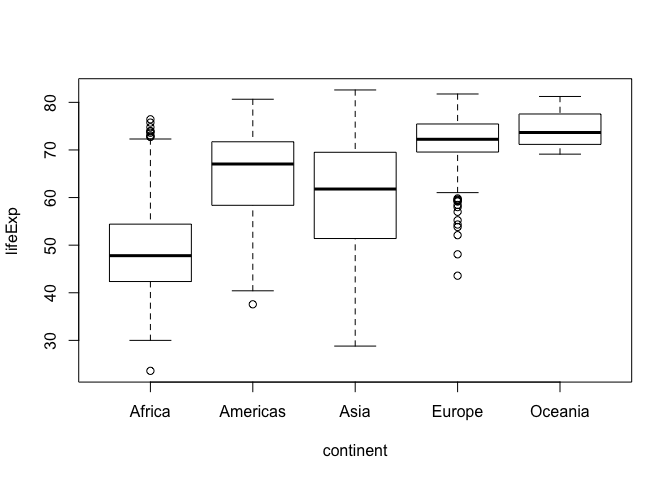 

```r
plot(lifeExp ~ year, gapminder)
```

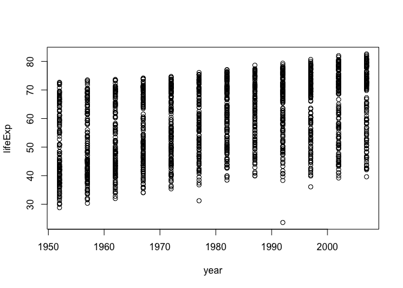 

```r
plot(gapminder$continent, gapminder$lifeExp)
```

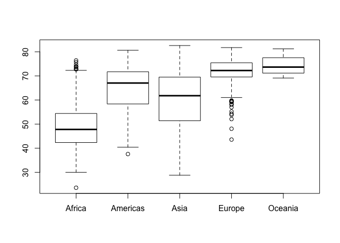 

```r
plot(lifeExp ~ log(gdpPercap), gapminder)
```

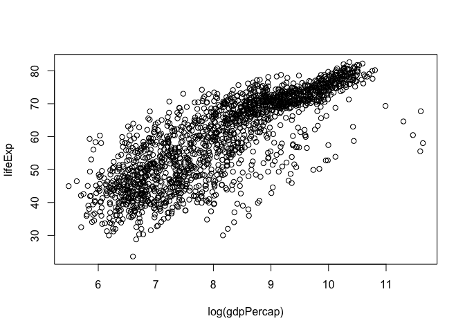 

```r
plot(lifeExp ~ country, gapminder)
```

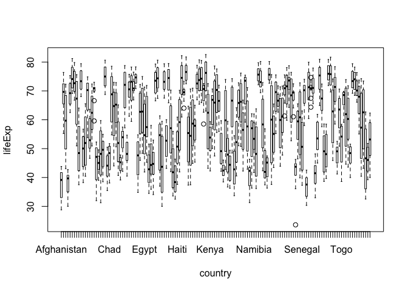 

```r
plot(lifeExp ~ continent, gapminder)
```

 

Exploring plot types:

barplots


```r
library(ggplot2)
barplot(table(gapminder$country))
```

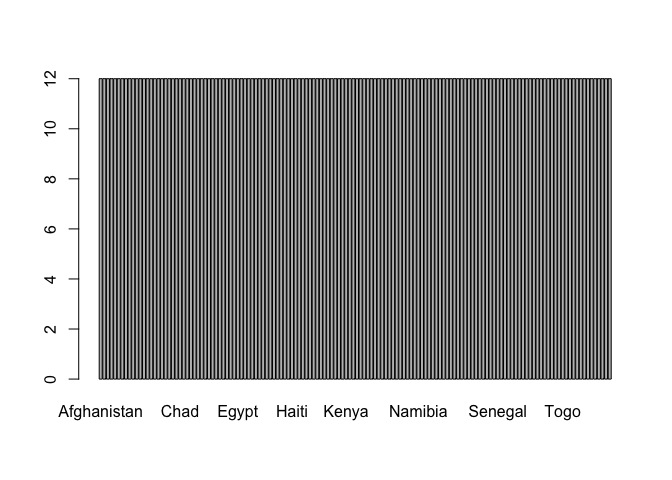 

```r
barplot(table(gapminder$continent))
```

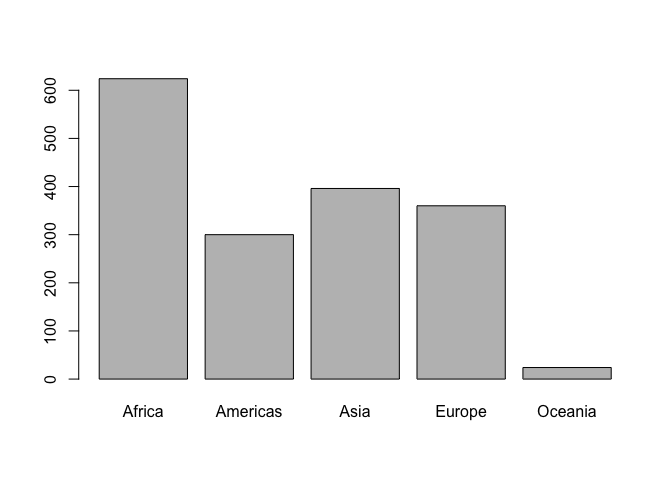 

```r
ggplot(gapminder, aes(x = continent)) + geom_bar()
```

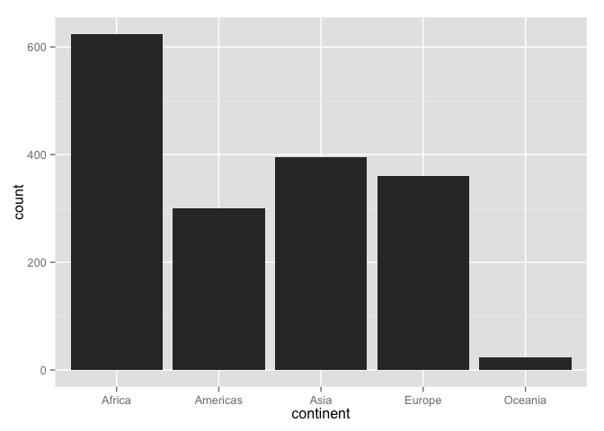 

```r
p <- ggplot(gapminder, aes(x = reorder(continent, continent, length)))
p + geom_bar()
```

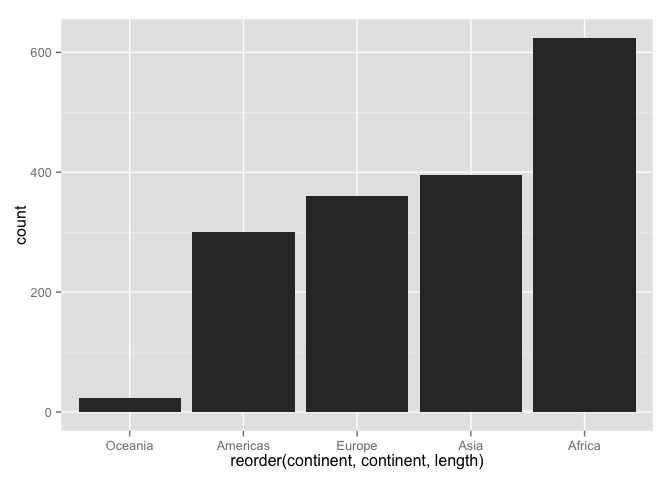 

```r
p + geom_bar(width = 0.05)
```

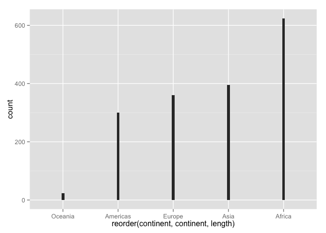 

scatterplots:


```r
p <- ggplot(gapminder, aes(x = pop, y = lifeExp))
p + geom_point()
```

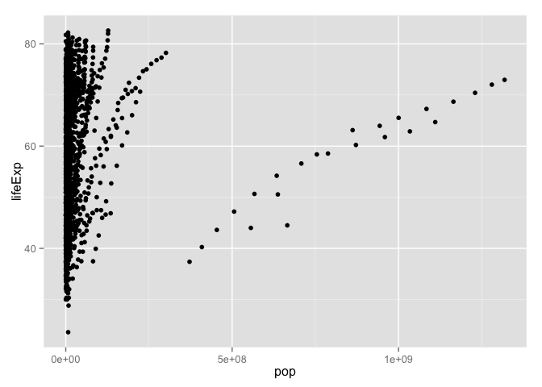 

```r
ggplot(gapminder, aes(x = log10(pop), y = lifeExp)) + geom_point()
```

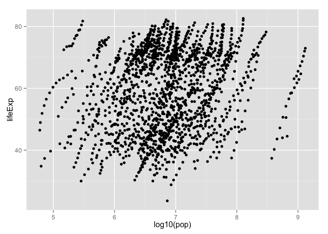 

```r
p + geom_point() + scale_x_log10()
```

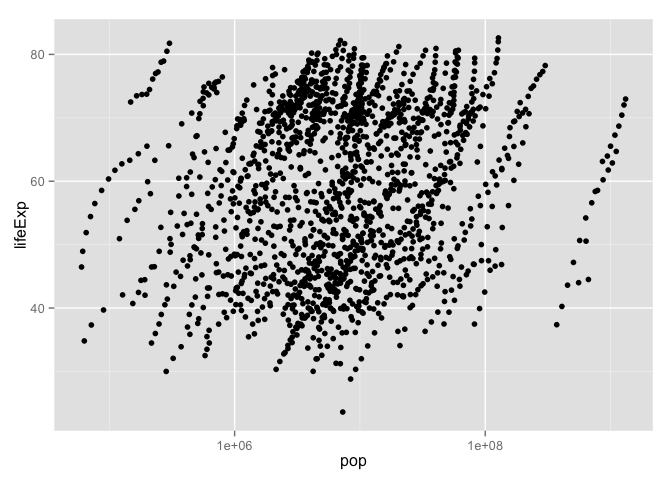 

```r
p <- p + scale_x_log10()
p + geom_point(aes(color = continent))
```

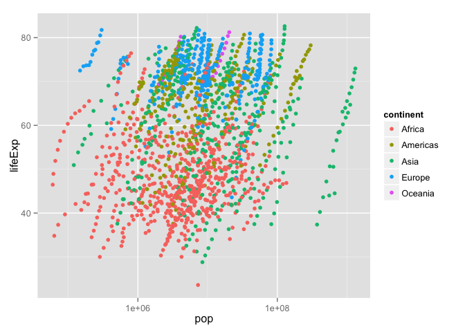 

```r
ggplot(gapminder, aes(x = pop, y = lifeExp, color = continent)) + geom_point() + scale_x_log10()
```

 

```r
p + geom_point(alpha = (1/3), size = 3)
```

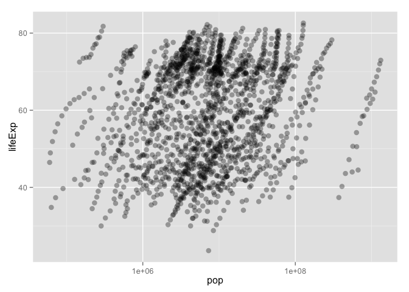 

```r
p + geom_point() + geom_smooth()
```

```
## geom_smooth: method="auto" and size of largest group is >=1000, so using gam with formula: y ~ s(x, bs = "cs"). Use 'method = x' to change the smoothing method.
```

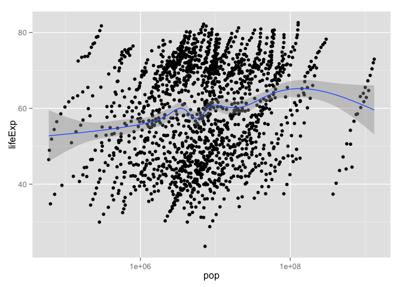 

```r
p + geom_point() + geom_smooth(lwd = 3, se = FALSE, method = "lm")
```

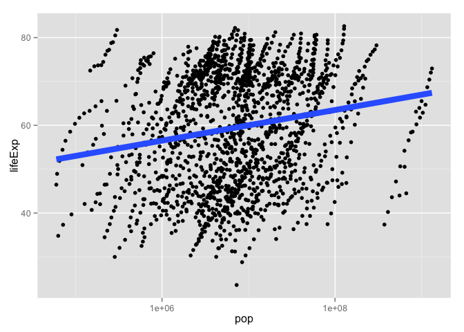 

```r
p + aes(color = continent) + geom_point() + geom_smooth(lwd = 3, se = FALSE)
```

```
## geom_smooth: method="auto" and size of largest group is <1000, so using loess. Use 'method = x' to change the smoothing method.
```

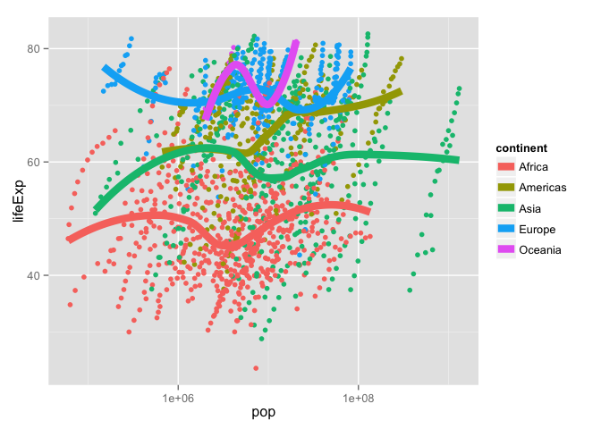 

```r
p + aes(color = continent) + geom_point() + geom_smooth(lwd = 3, se = FALSE, method = "lm")
```

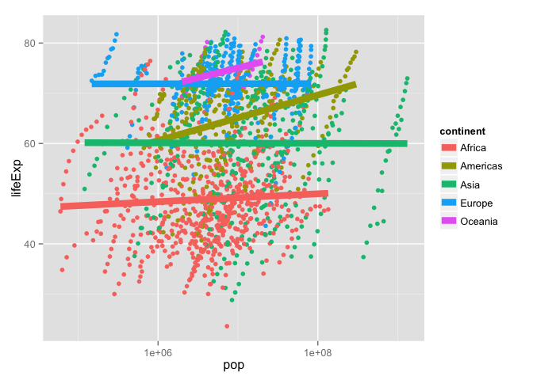 

```r
p + geom_point(alpha = (1/3), size = 3) + facet_wrap(~ continent)
```

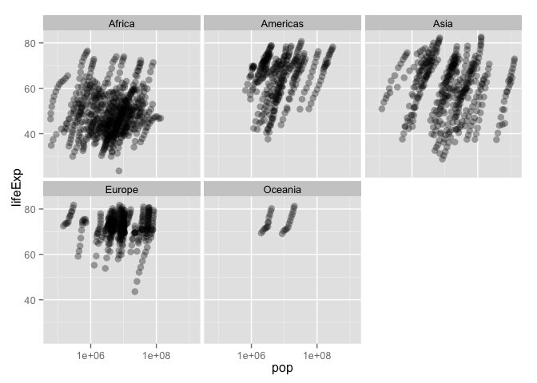 

```r
geom_smooth(lwd = 2, se = FALSE)
```

```
## geom_smooth: size = 2 
## stat_smooth: se = FALSE 
## position_identity: (width = NULL, height = NULL)
```

```r
geom_smooth(lwd = 2, se = FALSE, method = "lm")
```

```
## geom_smooth: size = 2 
## stat_smooth: se = FALSE, method = lm 
## position_identity: (width = NULL, height = NULL)
```

stripplots


```r
ggplot(gapminder, aes(x = continent, y = lifeExp)) + geom_point()
```

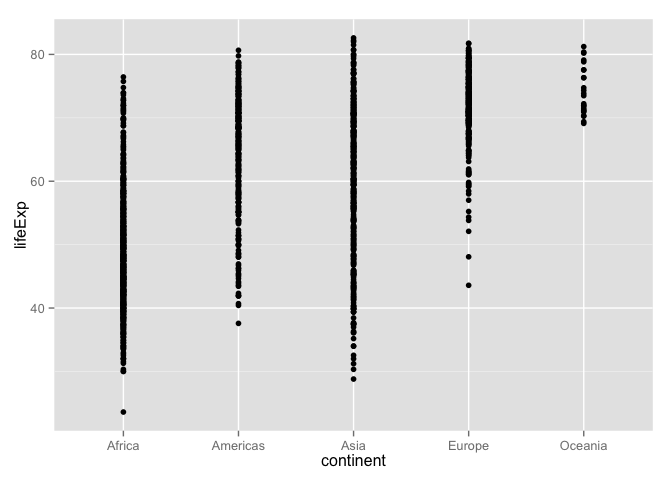 

```r
ggplot(gapminder, aes(x = continent, y = lifeExp)) + geom_jitter()
```

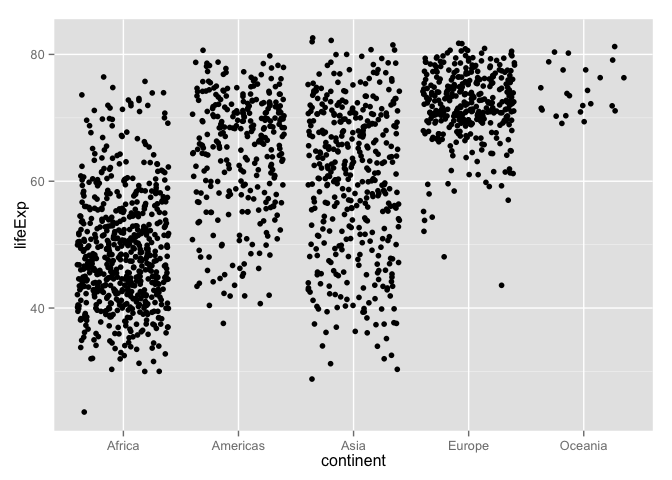 

```r
ggplot(gapminder, aes(x = continent, y = lifeExp)) + geom_jitter(position = position_jitter(width = 0.1, height = 0), alpha = 1/4)
```

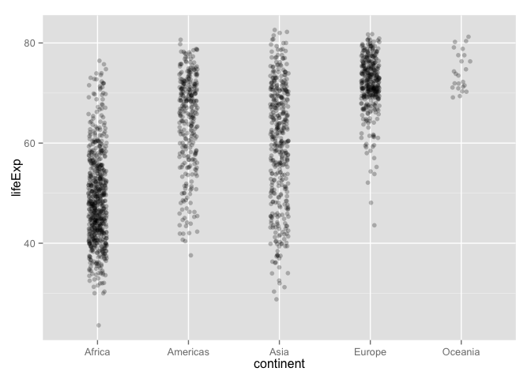 

boxplots


```r
ggplot(gapminder, aes(x = continent, y = lifeExp)) + geom_boxplot()
```

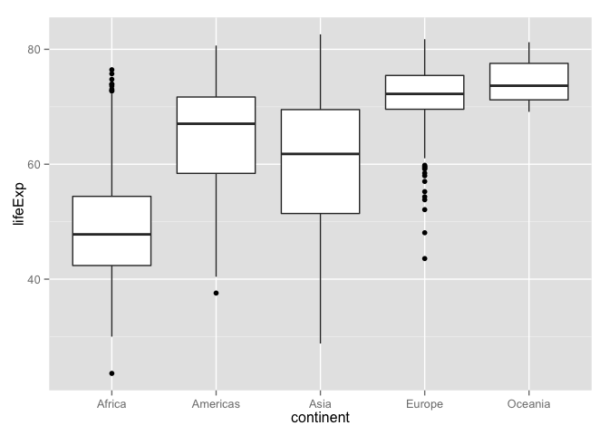 

```r
ggplot(gapminder, aes(x = continent, y = lifeExp)) + geom_boxplot(outlier.colour = "blue") + geom_jitter(position = position_jitter(width = 0.1, height = 0), alpha = 1/4)
```

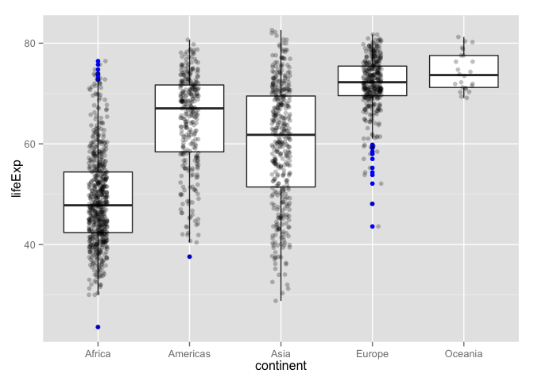 

```r
ggplot(gapminder, aes(x = continent, y = lifeExp)) + geom_jitter(position = position_jitter(width = 0.1), alpha = 1/4) + stat_summary(fun.y = median, colour = "red", geom = "point", size = 2)
```

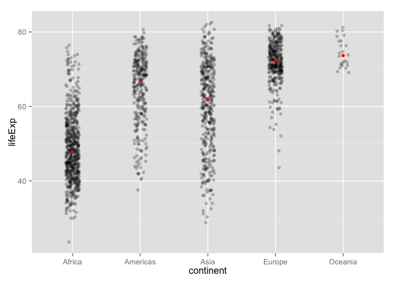 

```r
ggplot(gapminder, aes(reorder(x = continent, lifeExp), y = lifeExp)) +geom_jitter(position = position_jitter(width = 0.1), alpha = 1/4) + stat_summary(fun.y = median, colour = "red", geom = "point", size = 2)
```

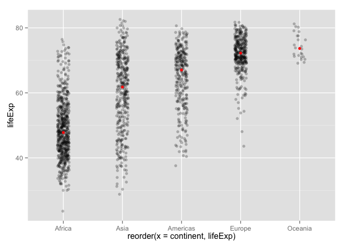 

histogram


```r
ggplot(gapminder, aes(x = lifeExp, fill = continent)) + geom_histogram()
```

```
## stat_bin: binwidth defaulted to range/30. Use 'binwidth = x' to adjust this.
```

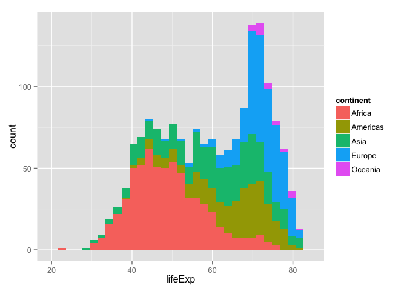 

```r
ggplot(gapminder, aes(x = lifeExp, color = continent)) + geom_density()
```

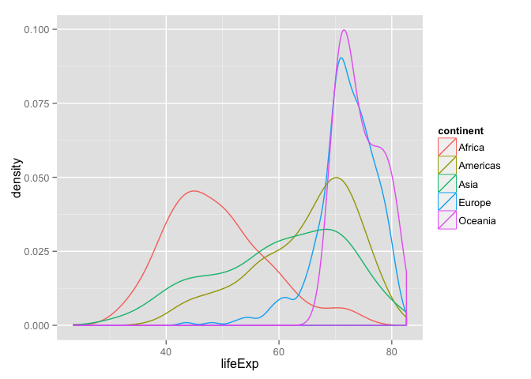 

```r
ggplot(gapminder, aes(x = lifeExp, fill = continent)) + geom_density(alpha = 0.2)
```

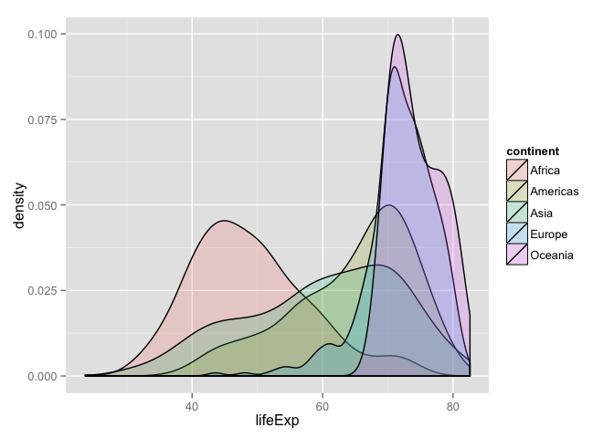 


I used the different ggplot tutorials supplied by Jenny. 
